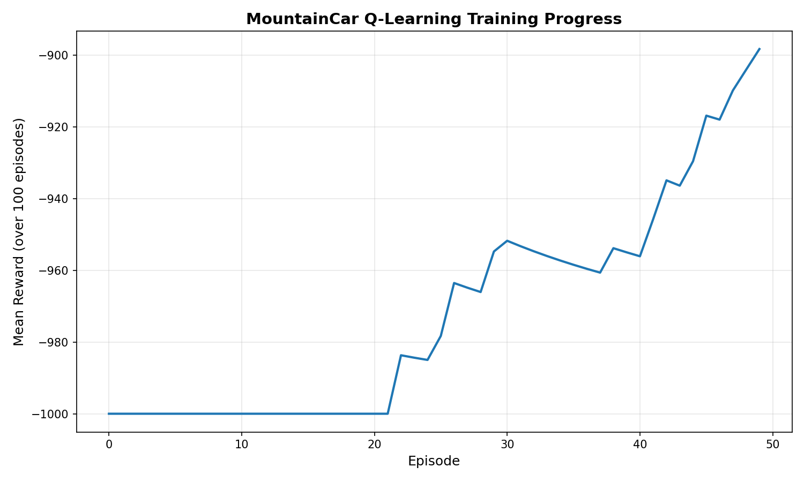

# 🏔️ MountainCar Q-Learning

A professional, modular reinforcement learning implementation that solves the classic **MountainCar-v0** environment from OpenAI Gymnasium using **Q-Learning** algorithm.



## 📋 Overview

This project demonstrates how a car stuck in a valley can learn to reach the goal at the top of the mountain using Q-Learning, a model-free reinforcement learning algorithm. The agent learns an optimal policy through trial and error, discovering that building momentum by moving back and forth is key to reaching the goal.

### The MountainCar Problem

- **Objective**: Drive an underpowered car up a steep mountain
- **Challenge**: The car's engine is not strong enough to climb the mountain in a single pass
- **Solution**: The agent must learn to build momentum by driving back and forth

## 🎯 Features

- ✅ **Modular Architecture**: Clean separation of concerns with dedicated modules
- ✅ **Q-Learning Implementation**: Tabular Q-learning with discretized state space
- ✅ **CLI Interface**: Easy-to-use command-line scripts for training and evaluation
- ✅ **Configuration Management**: YAML-based configuration for easy parameter tuning
- ✅ **Training Mode**: Train the agent from scratch and save the Q-table
- ✅ **Evaluation Mode**: Load pre-trained Q-table and evaluate performance
- ✅ **Visualization**: Automatic plotting of training progress with rolling mean
- ✅ **Performance Metrics**: Comprehensive evaluation statistics

## 🚀 Getting Started

### Prerequisites

- Python 3.8 or higher
- pip package manager

### Installation

1. **Clone the repository**
   ```bash
   git clone https://github.com/3bsalam-1/MountainCar.git
   cd MountainCar
   ```

2. **Install dependencies**
   ```bash
   pip install -r requirements.txt
   ```

3. **Optional: Install as package**
   ```bash
   pip install -e .
   ```

### Dependencies

- `gymnasium>=0.29.0` - OpenAI Gym environments
- `numpy>=1.24.0` - Numerical computing
- `matplotlib>=3.7.0` - Plotting and visualization

## 💻 Usage

### Training

Train the agent using the CLI script:

```bash
# Basic training (5000 episodes, no rendering)
python scripts/train.py

# Training with custom parameters
python scripts/train.py --episodes 10000 --learning-rate 0.8 --render

# Quick test (100 episodes)
python scripts/train.py --episodes 100 --no-render
```

**Training Options:**
- `--episodes`: Number of training episodes (default: 5000)
- `--bins`: Number of bins for state discretization (default: 20)
- `--learning-rate`: Learning rate α (default: 0.9)
- `--discount-factor`: Discount factor γ (default: 0.9)
- `--epsilon`: Initial exploration rate (default: 1.0)
- `--render` / `--no-render`: Enable/disable environment rendering
- `--save-path`: Path to save Q-table (default: models/mountain_car.pkl)
- `--plot-path`: Path to save training plot (default: outputs/plots/training_progress.png)

### Evaluation

Evaluate a trained agent:

```bash
# Evaluate with rendering (default)
python scripts/evaluate.py

# Evaluate with custom model
python scripts/evaluate.py --model-path models/my_model.pkl --episodes 20

# Evaluate without rendering
python scripts/evaluate.py --no-render
```

**Evaluation Options:**
- `--model-path`: Path to trained Q-table (default: models/mountain_car.pkl)
- `--episodes`: Number of evaluation episodes (default: 10)
- `--bins`: Number of bins for state discretization (default: 20)
- `--render` / `--no-render`: Enable/disable environment rendering

### Programmatic Usage

You can also use the package programmatically:

```python
from mountaincar import Trainer, Evaluator

# Train an agent
trainer = Trainer(num_bins=20, learning_rate=0.9, render=False)
rewards = trainer.train(episodes=5000)

# Evaluate the trained agent
evaluator = Evaluator(model_path='models/mountain_car.pkl', render=True)
metrics = evaluator.evaluate(episodes=10)
print(f"Success Rate: {metrics['success_rate']:.1f}%")
```

## 📁 Project Structure

```
MountainCar/
├── src/
│   └── mountaincar/           # Main package
│       ├── __init__.py        # Package initialization
│       ├── agent.py           # Q-Learning agent implementation
│       ├── trainer.py         # Training logic and loop
│       ├── evaluator.py       # Evaluation and metrics
│       └── utils.py           # Utilities (plotting, discretization)
├── scripts/
│   ├── train.py               # Training CLI entry point
│   └── evaluate.py            # Evaluation CLI entry point
├── config/
│   └── config.yaml            # Configuration parameters
├── models/
│   └── mountain_car.pkl       # Trained Q-tables
├── outputs/
│   └── plots/                 # Training visualizations
│       └── mountain_car.png
├── tests/                     # Unit tests (future)
├── .github/
│   └── workflows/             # CI/CD workflows
├── requirements.txt           # Python dependencies
├── setup.py                   # Package setup configuration
├── .gitignore                 # Git ignore rules
├── README.md                  # This file
├── AUTHOR                     # Project author
└── LAST_UPDATED               # Last update timestamp
```

## 🧠 Algorithm Details

### Q-Learning Parameters

| Parameter | Default | Description |
|-----------|---------|-------------|
| Learning Rate (α) | 0.9 | How much new information overrides old information |
| Discount Factor (γ) | 0.9 | Importance of future rewards |
| Initial Epsilon (ε) | 1.0 | Exploration rate (100% random at start) |
| Epsilon Decay | 2/episodes | Linear decay to 0 by end of training |
| State Bins | 20×20 | Discretization grid size |

### State Space Discretization

The continuous state space is discretized into a 20×20 grid:
- **Position**: 20 bins between -1.2 and 0.6
- **Velocity**: 20 bins between -0.07 and 0.07

### Action Space

The agent can choose from 3 discrete actions:
- **0**: Push left
- **1**: No push (neutral)
- **2**: Push right

### Q-Learning Update Rule

```
Q(s,a) ← Q(s,a) + α[r + γ·max(Q(s',a')) - Q(s,a)]
```

Where:
- `s` = current state
- `a` = action taken
- `r` = reward received
- `s'` = next state
- `α` = learning rate
- `γ` = discount factor

## 📊 Results

The training progress is visualized in `outputs/plots/training_progress.png`, showing the mean reward over a 100-episode rolling window. As training progresses:

- **Early episodes**: Agent explores randomly, often failing to reach the goal
- **Mid training**: Agent discovers the momentum strategy
- **Late training**: Agent consistently reaches the goal with optimal policy

## 🏗️ Architecture Benefits

### Performance
- ✅ **Modular imports**: Load only what's needed
- ✅ **Separation of concerns**: Easy to optimize individual components
- ✅ **Reusable components**: Agent, trainer, and evaluator can be used independently

### Maintainability
- ✅ **Clear organization**: Each module has a single responsibility
- ✅ **Easy navigation**: Find and modify specific functionality quickly
- ✅ **Better version control**: Changes are isolated to relevant modules

### Scalability
- ✅ **Extensible design**: Easy to add new algorithms or environments
- ✅ **Test-friendly**: Modular structure facilitates unit testing
- ✅ **Configuration-driven**: Change behavior without modifying code

## 🔧 Configuration

Edit `config/config.yaml` to customize default parameters:

```yaml
training:
  episodes: 5000
  num_bins: 20
  render: false

hyperparameters:
  learning_rate: 0.9
  discount_factor: 0.9
  epsilon: 1.0

paths:
  model_save: models/mountain_car.pkl
  plot_save: outputs/plots/training_progress.png
```

## 🧪 Testing

Run tests (when implemented):

```bash
pytest tests/
```

## 🎓 Learning Outcomes

This project demonstrates:
- **Reinforcement Learning Basics**: Agent-environment interaction, rewards, and policies
- **Q-Learning Algorithm**: Value-based method for learning optimal policies
- **Exploration vs Exploitation**: Balancing discovery with using known strategies
- **State Discretization**: Converting continuous spaces to discrete representations
- **Software Engineering**: Modular design, separation of concerns, and clean architecture

## 🤝 Contributing

Contributions are welcome! Feel free to:
- Report bugs
- Suggest new features
- Submit pull requests
- Improve documentation

## 📜 License

This project is open source and available for educational purposes.

## 👤 Author

**3bsalam-1**

## 📅 Last Updated

December 10, 2025

---

**Happy Learning! 🚗💨**
